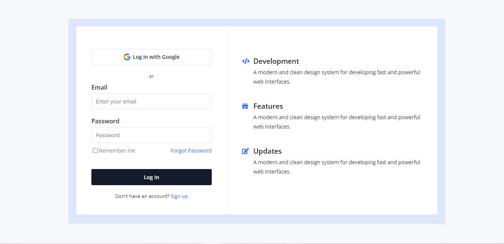

# HTML & CSS UI Components

Here we will make UI components using HTML and CSS.

## Links to original designs:

1. [Blog Cards](https://uidesigndaily.com/posts/sketch-blog-cards-post-article-thumbnail-day-997)
2. [Login](https://uidesigndaily.com/posts/sketch-login-log-in-authentication-features-day-1022)
3. [Ads Manager](https://uidesigndaily.com/posts/sketch-ads-manager-table-list-day-1049)

 

 Screenshot of Blog cards

 

Screenshot of login page

 

Screenshot of ad-manager

